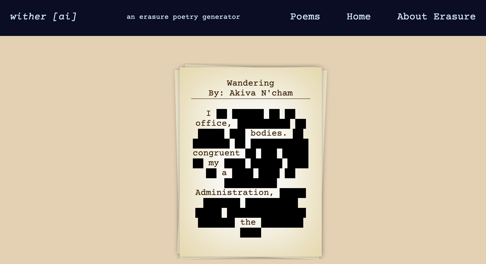

# wither [ a i ]

#### by: jake edgar

## DESCRIPTION

- wither ai is a full-stack web application that takes an input from a user and returns the users input in the style of erasure poetry. The application was built alongside a sibling application, the foxing css library, which can be found here: [foxing-css](https://github.com/jakeedgar/foxingcss)

## TECHNOLOGIES USED

 

 

As well as:

- reactstrap
- Axios
- React Router Dom
- UUID

## Diagram of Application

Image of Application Diagram Here: [App-Diagram](public/poem-app-diagram.png)

## SETUP & INSTALLATION

- Navigate to your preferred code editing software, I recommend VSCode.
- Clone this repository to your desktop by using the command `git clone` followed by this link `https://github.com/jakeedgar/withering-poetry-gen.git`
- Navigate to the top level of the directory with the command `cd withering-poetry-gen`
- Ensure Node is install by running with the command `NPM -v` in your terminal, and if it is not use your preferred installer to install Node.
- Navigate to the 'just-javascript' branch for the most functional version of the application with the command `git checkout just-javascript`
- navigate to the 'javascript-client' directory.
- `NPM install` to install dependencies.
- If you plan to update the project make sure you push the .gitignore file to github first by using `git add .gitignore` and then pushing it to your personal github.
- `NPM run start` to run the program in your browser.

## KNOWN BUGS

- Full stack client server shell completely non-functional.
- Front end meta stack with firestore also non-functional.

## LICENSE

Licensed under the [MIT License](LICENSE)
