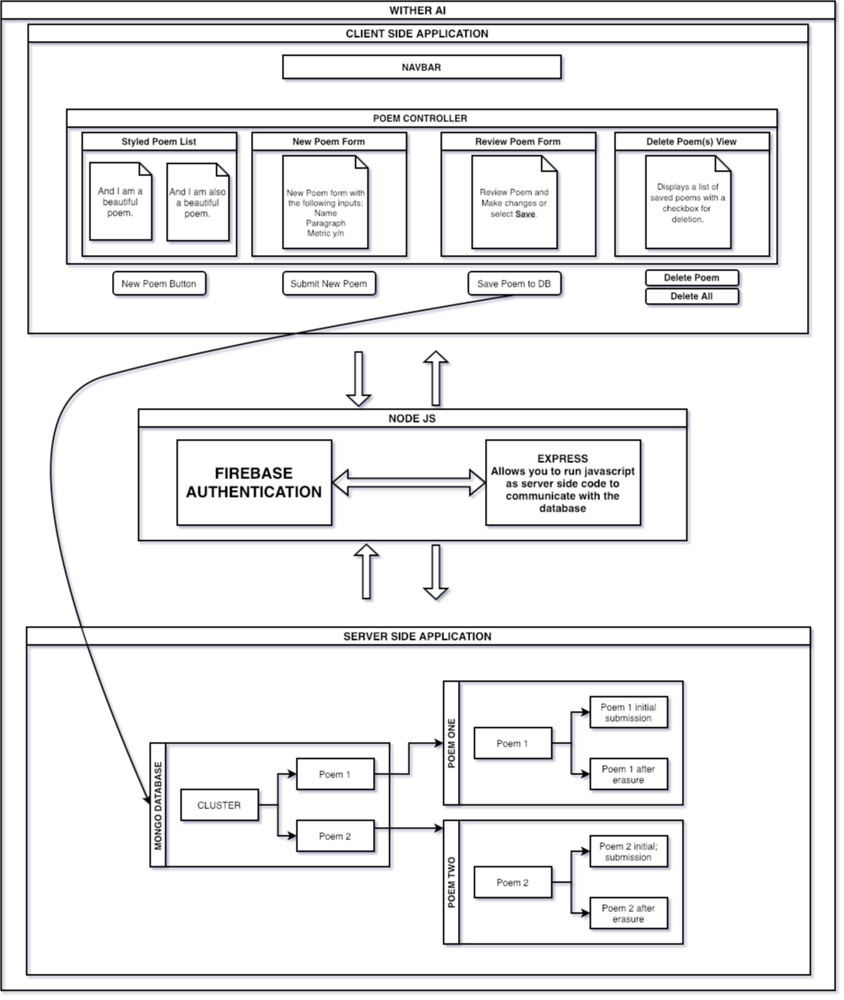

# wither [ a i ]

#### by: jake edgar

## DESCRIPTION

- wither ai is a full-stack web application that takes an input from a user and returns the input in the style of erasure poetry.

## Diagram of Application

 
 

 
 
